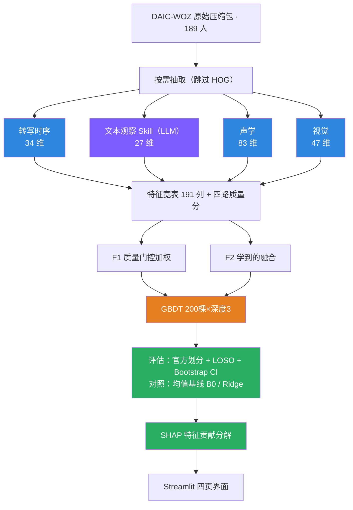
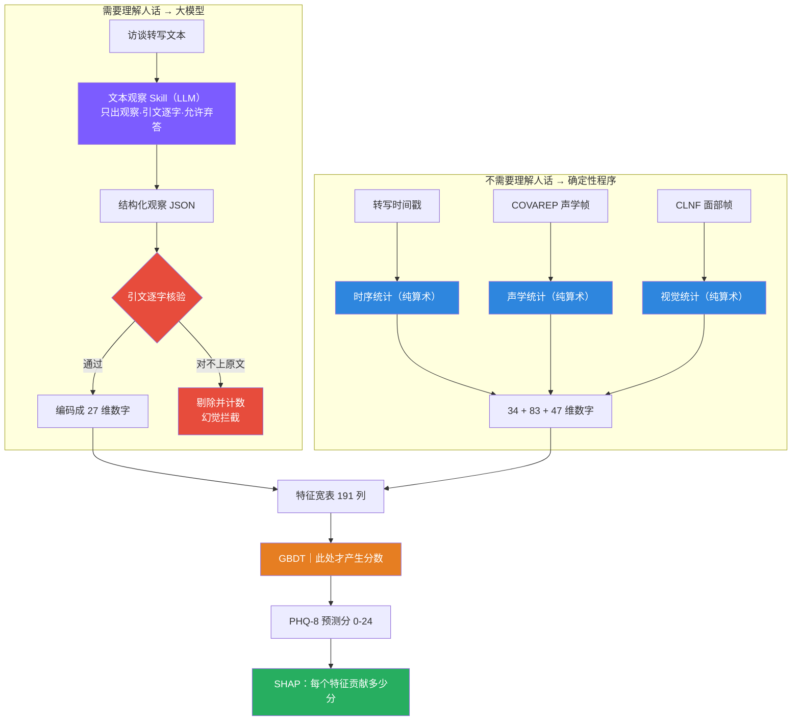

# 实验流程图 · 生图提示词集（6 张）

对应方案：v3 预测模型版 · DAIC-WOZ / PHQ-8 回归

---

## 使用说明（先读，省你几小时）

**1. 中文标签会糊。** 目前所有主流生图模型渲染汉字的准确率都很低，尤其是小字号、多框的技术图。两条对策，选一条：
- **推荐**：用下面每张图的「英文标签版」出图，出图后在 Figma / PPT / Canva 里把文字层换成中文。图像模型画英文准确率高得多。
- **省事**：直接用中文提示词，出图后照「文字校对清单」逐框核对，错字用 PPT 文本框盖掉。

**2. 图像模型不保证信息准确。** 它画的是"看起来像流程图的图"，框数、箭头方向、层级都可能自作主张。**每张图必须照校对清单核对**，尤其是箭头方向和 LLM 节点的位置——那是你答辩的立论所在，画错等于自毁。

**3. 要 100% 精确就用 Mermaid。** 图 1 和图 2 我附了 Mermaid 源码，粘到 <https://mermaid.live> 就能导出 SVG/PNG，字一个都不会错。缺点是样式朴素，适合放研究报告；生图模型的版本适合放 PPT 封面和答辩。另外四张的 Mermaid 我随时可以补。

**4. 出图参数**：比例 16:9（图 5 用 3:4），分辨率拉到最高，一次出 4 张挑一张。

---

## 通用风格块（STYLE）

下面每张图的提示词里凡出现 `[STYLE]`，都替换成这一整段：

```
technical flowchart infographic, flat vector illustration, clean minimal engineering
diagram style, white background #FAFAFA, rounded rectangle nodes with 8px radius,
thin 1.5px arrows with small solid arrowheads, generous whitespace, no 3D, no gradient,
no drop shadow, no hand-drawn look, no photorealism, sharp legible sans-serif labels,
color code: purple #7C5CFF = LLM node, blue #2E86DE = deterministic program node,
gray #7F8C8D = data / storage, orange #E67E22 = machine-learning model,
green #27AE60 = evaluation, red #E74C3C = discipline / guard node,
16:9 aspect ratio, high resolution, publication quality
```

---

## 图 1｜总体实验流水线（七层架构）

### 用途
回答"我这个系统从数据到结果一共几步"。放研究报告第一张图、答辩 PPT 系统架构页。**这张图最重要的信息不是七层，而是紫色 LLM 节点只出现一次**。

### 提示词（中文标签版）

```
[STYLE]

画一张自上而下七层的技术流程图，每一层是一条横向色带，层与层之间用垂直箭头连接。

第1层 数据层（灰色）：一个节点"DAIC-WOZ 原始压缩包 189 人"，箭头指向节点"按需抽取，跳过 HOG 大文件"。
第2层 特征层（关键层，画成四条并行的竖直支路，从左到右）：
  支路A 蓝色"转写时序 34 维（响应延迟/静默/说话占比）"
  支路B 紫色"文本观察 Skill｜LLM 唯一出现处 → 27 维"，节点右上角画一个紫色小星标
  支路C 蓝色"声学 83 维（F0/声门源/共振峰/发声节奏）"
  支路D 蓝色"视觉 47 维（14个AU/注视/头部姿态）"
第3层 融合层（灰色）：一个宽节点"特征宽表 191 列 + 四路质量分"，下面并列两个小节点"F1 质量门控加权""F2 学到的融合"。
第4层 预测层（橙色）：主节点"梯度提升树 GBDT 200棵×深度3"，右侧一个较小的对照节点"Ridge 线性对照"。
第5层 评估层（绿色）：三个并列节点"官方划分 107/35/47""留一验证 LOSO""Bootstrap 置信区间"，下方一个节点"均值基线 B0 对照"。
第6层 解释层（绿色）：节点"SHAP 特征贡献分解 → 每个预测可追溯到原始数据"。
第7层 界面层（灰色）：节点"Streamlit 四页界面：数据状态 / Skill配置 / 观察查看器 / 实验面板"。

右侧留一列纵向图例：紫色=大模型、蓝色=确定性程序、橙色=机器学习模型、绿色=评估与解释、灰色=数据与界面。
图例下方一行强调文字："四路特征中仅一路使用大模型"。
```

### 提示词（英文标签版，渲染更准）

把上面所有引号内的中文换成：`Raw DAIC-WOZ archives (189 subjects)` / `Selective extraction, skip HOG` / `Transcript timing · 34 dims` / `Text Observation Skill — the ONLY LLM · 27 dims` / `Acoustic · 83 dims` / `Visual · 47 dims` / `Feature table · 191 cols + 4 quality scores` / `F1 quality-gated weighting` / `F2 learned fusion` / `Gradient Boosted Trees (200 × depth 3)` / `Ridge (linear control)` / `Official split 107/35/47` / `Leave-One-Subject-Out` / `Bootstrap 95% CI` / `Mean baseline B0` / `SHAP attribution → traceable to raw data` / `Streamlit UI · 4 pages`，图例：`LLM / Deterministic / ML model / Evaluation / Data & UI`，强调句：`Only 1 of 4 feature lanes uses an LLM`。

### 文字校对清单
七层名称齐全；四路维数分别是 **34 / 27 / 83 / 47**；只有文本观察一路是紫色；GBDT 是 **200 棵 × 深度 3**；官方划分是 **107 / 35 / 47**；箭头一律向下，第 2 层四路并行不互连。

### Mermaid 精确版（粘到 mermaid.live 导出）



---

## 图 2｜Agent 与小模型的分工（你的核心立论）

### 用途
**这是最重要的一张。** 专门回答"你是不是就是套个大模型"和"黑箱不黑箱"。答辩必放。

### 提示词（中文标签版）

```
[STYLE]

画一张左右分区的对比式技术流程图，中间有一条垂直虚线把画面分成两个区域。

左区标题"需要理解人话 → 交给大模型"（紫色区域）：
  输入节点（灰色）"访谈转写文本"
  箭头指向紫色节点"文本观察 Skill（大模型）"
  该节点下方列出三行小字规则："只出观察，不出分数""引文必须逐字对回原文""允许弃答"
  箭头指向灰色节点"结构化观察 JSON"
  再箭头指向红色菱形判断节点"引文逐字核验"，从菱形分出两条：
    向下箭头标注"通过"指向蓝色节点"编码成 27 维数字"
    向右箭头标注"对不上原文 → 剔除并计数"指向红色小节点"幻觉拦截"

右区标题"不需要理解人话 → 交给确定性程序"（蓝色区域）：
  三个并列的灰色输入节点"转写时间戳""COVAREP 声学帧""CLNF 面部帧"
  分别箭头指向三个蓝色节点"时序统计（纯算术）""声学统计（纯算术）""视觉统计（纯算术）"
  三者箭头汇聚到蓝色节点"34 + 83 + 47 维数字"

两区在底部汇合：
  两条箭头共同指向一个宽的灰色节点"特征宽表 191 列"
  箭头向下指向橙色节点"梯度提升树 GBDT｜此处才产生分数"
  箭头向下指向绿色节点"PHQ-8 预测分（0-24）"
  箭头向下指向绿色节点"SHAP 分解：每个特征贡献多少分"

画面右下角放一个强调文本框，红色边框："大模型不产生分数，只产生可核验的数字；分数由树模型的可打印权重决定。"
```

### 提示词（英文标签版）

左区标题 `Needs language understanding → LLM`，右区标题 `No language understanding needed → deterministic code`。节点：`Interview transcript` / `Text Observation Skill (LLM)` + 规则 `Observations only, no scores` `Quotes verified verbatim` `May abstain` / `Structured observation JSON` / `Verbatim quote check` / `Encode to 27 numeric dims` / `Hallucination blocked` / `Transcript timestamps` `COVAREP acoustic frames` `CLNF facial frames` / `Timing stats (arithmetic)` `Acoustic stats (arithmetic)` `Visual stats (arithmetic)` / `34 + 83 + 47 numeric dims` / `Feature table · 191 cols` / `Gradient Boosted Trees — scores originate HERE` / `PHQ-8 prediction (0–24)` / `SHAP attribution per feature`。强调框：`The LLM never outputs a score — only verifiable numbers. Scores come from printable tree weights.`

### 文字校对清单
LLM 节点**只有一个**且在左区；"此处才产生分数"必须挂在 GBDT 上而不是 LLM 上；核验菱形必须有"剔除"那条分支；右区三路都要标"纯算术"。

### Mermaid 精确版



---

## 图 3｜消融实验设计矩阵（证明多模态和 Skill 真有用）

### 用途
回答"你凭什么说多模态更好、凭什么说你的 Skill 架构比直接让大模型打分好"。这张图是研究报告实验章节的骨架。

### 提示词（中文标签版）

```
[STYLE]

画一张实验设计对比图，采用横向分组的柱状排布式布局（不是数据图表，是设计示意图），
从上到下分成四个实验组，每组是一个带标题的横向容器。

第一组 基线组（灰色容器）标题"B0 基线：不看任何特征"：
  一个节点"训练集均值直接预测"，右侧标注"任何方法都必须打败它"。

第二组 单路组（蓝色容器）标题"A 组：单路特征各自能力"：
  四个并列节点，各自下方标注维数：
  "A1 转写时序 34维""A2 文本观察 27维（LLM）""A3 声学 83维""A5 视觉 47维"
  A2 节点用紫色，其余蓝色。

第三组 组合组（深蓝容器）标题"B 组：逐步叠加，看增益从哪来"：
  四个节点用向右的箭头串成递进链：
  "B1 时序""B2 时序+声学""B3 时序+声学+视觉""B4 全部四路"
  每个箭头上方标注"+ 一路"。

第四组 架构对比组（红紫容器，最重要）标题"D 组：架构之争 —— 这是创新性的证明"：
  左侧紫色节点"D1 纯大模型直接打分（黑箱对照）"，下方小字"不可复现·不可解释·证据可能编造"
  中间画一个大的"VS"
  右侧橙色节点"D2 大模型出观察 + 树模型出分（本方案）"，下方小字"可复现·SHAP可解释·引文可核验"
  两者下方共同指向一个绿色节点"若 D2 > D1，则分层架构主张成立"

画面右侧纵向留一列评价指标清单（绿色小字）："Spearman 相关系数""RMSE 均方根误差""PR-AUC""Bootstrap 95% 置信区间""留一验证 LOSO"。
```

### 提示词（英文标签版）

组标题：`B0 Baseline: no features at all` / `Group A: single-lane capability` / `Group B: incremental stacking` / `Group D: architecture showdown — the innovation claim`。节点：`Predict training mean` + `every method must beat this` / `A1 Timing 34d` `A2 Text observations 27d (LLM)` `A3 Acoustic 83d` `A5 Visual 47d` / `B1 Timing` `B2 +Acoustic` `B3 +Visual` `B4 All four lanes` / `D1 LLM scores directly (black-box control)` + `not reproducible · not explainable · quotes may be fabricated` / `VS` / `D2 LLM observations + tree model scores (ours)` + `reproducible · SHAP-explainable · quotes verified` / `If D2 > D1, the layered architecture claim holds`。指标列：`Spearman ρ` `RMSE` `PR-AUC` `Bootstrap 95% CI` `LOSO`。

### 文字校对清单
四组齐全且 B0 在最上；A2 是紫色其余蓝色；D1 标"黑箱对照"、D2 标"本方案"；D 组底部那句结论箭头方向朝下；**没有 A4**（wav2vec 那路暂缓，别让模型自己补一个）。

---

## 图 4｜单个被试的数据处理时序（最容易讲清楚的一张）

### 用途
回答"具体到一个人，你的系统到底做了什么"。适合演示环节口头讲解时配图。

### 提示词（中文标签版）

```
[STYLE]

画一张从左到右的横向泳道流程图，四条水平泳道，代表一个被试（编号 303）的数据流。

泳道1（灰色）标题"原始数据"：三个方块依次排列"转写 TRANSCRIPT.csv""声学 COVAREP.csv""面部 CLNF_features.txt"。
泳道2（蓝紫混合）标题"特征抽取"：
  从转写分出两条箭头，一条向上到蓝色方块"时序统计"，一条向下到紫色方块"LLM 观察抽取"
  声学箭头到蓝色方块"声学统计（按 VUV 过滤无声帧）"
  面部箭头到蓝色方块"视觉统计（按 success + confidence 过滤）"
泳道3（灰色）标题"质量门控"：一个方块"四路质量分：转写 0.95 / 声学 0.88 / 视觉 0.012"，
  在视觉那一项旁边画一个红色警告三角，标注"有效跟踪帧仅 1.2%，此路自动降权"
泳道4（橙绿）标题"预测与解释"：
  橙色方块"GBDT 预测 PHQ-8 = 12.4"
  箭头指向绿色方块"SHAP 分解"，其下三行小字：
  "响应延迟 p90 = 2.3 秒 → 贡献 +0.8 分"
  "声学 mcep0 均值偏低 → 贡献 +2.1 分"
  "积极信号出现 2 次 → 贡献 −1.3 分"
  最后箭头指向绿色方块"可回溯到转写第 340 行的 18 秒沉默"

底部横向画一条时间轴箭头，标注"同一被试，同一时间窗，四路证据互相印证"。
```

### 提示词（英文标签版）

泳道：`Raw data` / `Feature extraction` / `Quality gating` / `Prediction & explanation`。节点：`TRANSCRIPT.csv` `COVAREP.csv` `CLNF_features.txt` / `Timing stats` `LLM observation extraction` `Acoustic stats (VUV-filtered)` `Visual stats (success + confidence filtered)` / `Quality: transcript 0.95 / acoustic 0.88 / visual 0.012` + warning `only 1.2% valid tracked frames → lane down-weighted` / `GBDT predicts PHQ-8 = 12.4` / `SHAP attribution` + `response latency p90 2.3s → +0.8` `low mcep0 mean → +2.1` `positive signals ×2 → −1.3` / `traceable to an 18s silence at transcript line 340`。时间轴：`Same subject, same window — four evidence lanes cross-checking`。

### 文字校对清单
质量门控那一栏视觉分必须是**极低值 + 红色警告**（这是真实发生的案例，319 号被试）；SHAP 三行里必须有**一行是负贡献**（体现积极信号会拉低风险，不是只找坏的）；预测值 12.4 是示意，标注"示意"避免被当成真实结果。

---

## 图 5｜实验纪律与可信度保障（评委最爱问的部分）

### 用途
回答"你的结果可信吗、有没有在测试集上调参、大模型幻觉怎么办"。这张图建议用 **3:4 竖版**，放在报告附录或答辩备用页。

### 提示词（中文标签版）

```
[STYLE]
（把 STYLE 里的 16:9 改成 3:4 竖版）

画一张竖版的防护机制清单图，中央一条垂直主轴线，五个红色盾牌图标沿轴线从上到下排列，
每个盾牌右侧是一个说明卡片（白底细边框）。

盾牌1"测试集隔离"：卡片内容"47 人测试集全程锁定，标签加载函数默认不读取；
  提示词迭代只在训练集上进行；界面默认隐藏测试样本，需显式勾选并显示警告"
盾牌2"幻觉拦截"：卡片内容"大模型每条观察的引文必须逐字对回原文；
  对不上即剔除并计入统计；编造的证据无法进入特征矩阵"
盾牌3"版本可复现"：卡片内容"提示词内容哈希即版本号（当前 bbdb778be15e）；
  记录请求模型与响应实际模型；记录 token 用量以探测中转注入"
盾牌4"统计谨慎"：卡片内容"所有相关系数附 Bootstrap 95% 置信区间；
  置信区间跨零即报告为不显著；小样本阶段只看方向不下结论"
盾牌5"双协议验证"：卡片内容"官方划分 107/35/47 保证可比性；
  留一验证 LOSO 提高小样本稳定性；两者结果同时报告，不挑好看的"

底部一个灰色横条，内容"已实测拦截的问题：特征矩阵混入被试编号导致的伪相关（已修）、
中转站静默注入系统提示词（已探测）、三个被试视觉跟踪失败（已自动降权）"。
```

### 提示词（英文标签版）

盾牌标题：`Test-set isolation` / `Hallucination interception` / `Reproducible versioning` / `Statistical caution` / `Dual-protocol validation`。底部条：`Issues actually caught: subject-ID leakage into features (fixed), silent proxy prompt injection (detected), 3 subjects with failed face tracking (auto down-weighted)`。

### 文字校对清单
五个盾牌齐全；测试集人数是 **47**；官方划分 **107/35/47**；底部三条"已实测拦截"都是真实发生过的，别让模型改写成通用套话。

---

## 图 6｜界面与人机协同（可选，展示落地感）

### 用途
展示这不只是脚本堆，而是可操作的系统。适合放 PPT 演示页。做不做取决于你时间，优先级最低。

### 提示词（中文标签版）

```
[STYLE]

画一张四宫格的界面示意图（wireframe 风格，不要真实截图质感），每格是一个浏览器窗口框，
窗口顶部有标签栏，内容用灰色色块和简单图形示意，只在标题处写文字。

左上"数据状态"：示意内容为一个进度条（标注"训练集 20/107"）、一个缺包清单列表、一个拖拽上传区。
右上"Skill 与模型配置"：示意内容为两张配置卡片，每张含下拉框、密文输入框、
  三个按钮（标注"测试连通""拉取模型列表""检测推理强度实效"）。
左下"观察查看器"：示意内容为左右分栏，左栏是一段文本其中有绿色高亮和红色高亮两处，
  右栏是观察条目列表；在绿色高亮旁标注"引文核验通过"，红色旁标注"幻觉已剔除"。
右下"实验面板"：示意内容为一列实验组按钮（标注"A1""A3""A5""B4""D1""D2"）、
  一张结果表格、一个带误差棒的点图示意。

整体风格保持线框图质感，颜色克制，突出四个功能分区而不是视觉华丽。
```

### 提示词（英文标签版）

窗口标题：`Data status` / `Skill & model config` / `Observation viewer` / `Experiment panel`。按钮：`Test connection` `List models` `Verify reasoning effort`。标注：`Training set 20/107` / `quote verified` / `hallucination removed`。

### 文字校对清单
观察查看器必须**同时**出现绿色和红色高亮（这是防幻觉的可视化证明）；实验面板的实验组编号里**没有 A4**；进度条数字与你出图当天的实际进度一致。

---

## 优先级建议

时间有限就按这个顺序做：

1. **图 2**（分工与黑箱之辩）—— 你的立论所在，必做
2. **图 1**（总体流水线）—— 报告开篇必做
3. **图 3**（消融矩阵）—— 实验章节骨架，必做
4. 图 4（单被试时序）—— 演示讲解好用
5. 图 5（实验纪律）—— 答辩防守用
6. 图 6（界面）—— 有余力再做

图 1 和图 2 我给了 Mermaid，**建议报告里直接用 Mermaid 版**（零错字），生图版只用于 PPT 视觉。另外四张要 Mermaid 我随时补。


